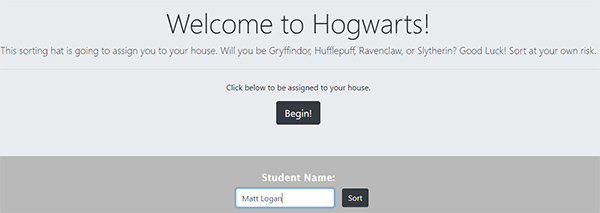
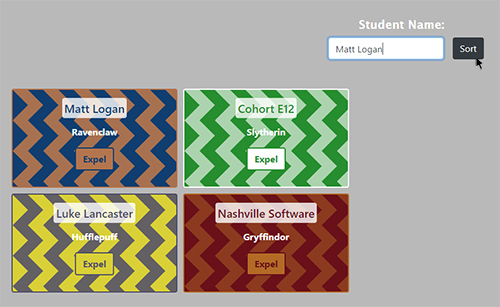
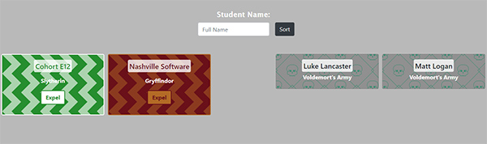
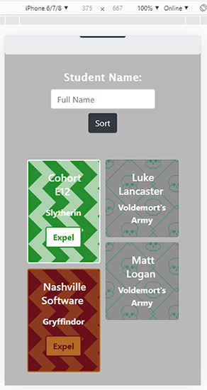

# NSS E12 Exercise - Sorting Hat

## Description:
The objective of the exercise was to create a Sorting Hat using HTML, CSS, and JavaScript. The sorting hat takes a Student Name input and assigns the student to a random Harry Potter house. The outputed card has an 'Expel' button that expels the student from their assigned house, and places them in 'Voldermort's Army.' The projects design is responsive and looks great on any size screen. 

## Screenshots:
##### Main View / Student Input

##### Student Sorted to Random House

##### Student Expelled to Voldemort's Army

##### Responsive Design

## How To Run:
>1. Clone down this repo.
>1. Install [http-server](https://www.npmjs.com/package/http-server).
>1. Navigate to folder in command line and type `http-server -p 8080`.
>1. Go to `http://localhost:8080` in your browser.
